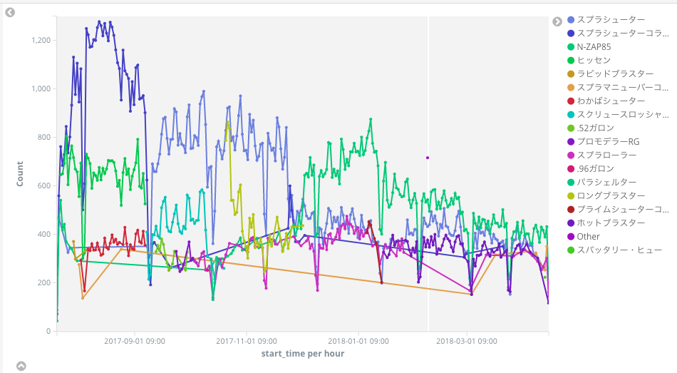

visualize_splatoon
====

スプラトゥーン2の結果を取得したjsonファイルから、ローカルに立ち上げたKibana + Elasticsearchにデータをロードします。

現在は以下の可視化に対応しています。  

* リーグマッチランキング
* ステージ情報

# how to setup

## run containers

### start container

```
docker-compose up
```

### apply index templates

```
sh setup_es_templates.sh
```

# how to run

## bulk data

```
python bulk_league_ranking.py
```

# how to access

Access to Kibana:  
http://localhost:5601/



# caution

elasticsearchのURLは `localhost:9200` 固定です。


